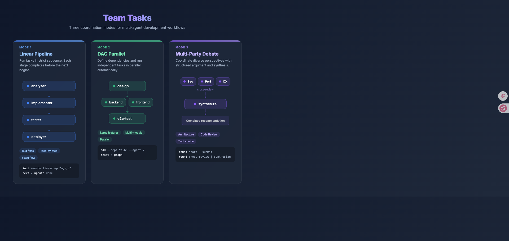
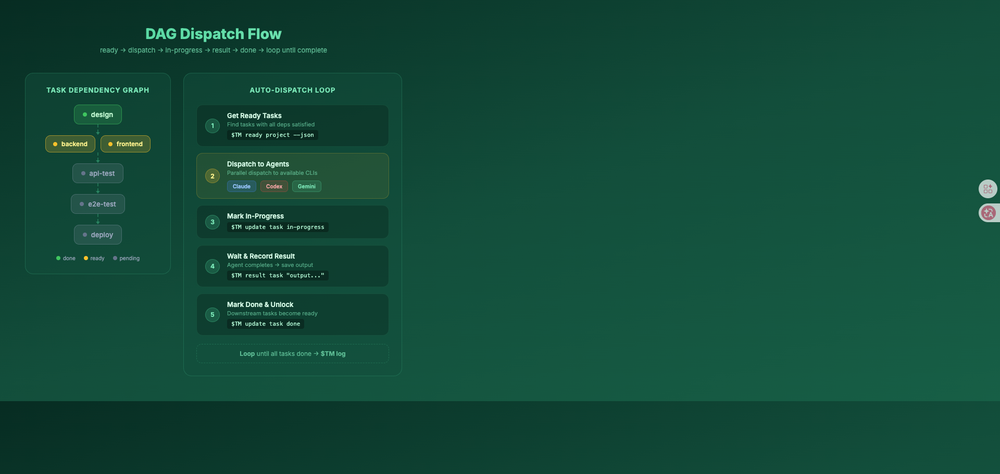
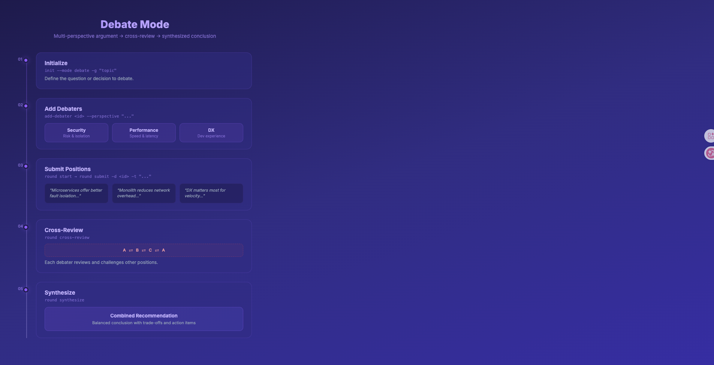

[English](README.md) | [繁體中文](README.zh.md)

# team-tasks

Multi-agent task coordination for Claude Code. Orchestrate development workflows using JSON task files with three modes: linear pipelines, DAG-based parallel execution, and multi-party debate.

<p align="center">
  
</p>

## What It Does

`team-tasks` provides a CLI (`~/.local/bin/maestro project`) that lets you:

- **Linear Pipeline** — Run tasks in strict sequence (e.g., code -> test -> docs). Ideal for bug fixes and step-by-step verification.
- **DAG (Directed Acyclic Graph)** — Define tasks with dependencies and run independent tasks in parallel. Suited for large features with multiple modules.
- **Debate** — Coordinate multiple perspectives on a decision (e.g., architecture review), with rounds of argument, cross-review, and synthesis.

Tasks are stored as JSON in `~/.claude/data/team-tasks/` (configurable via `TEAM_TASKS_DIR`).

## Installation

This is a [Claude Code skill](https://docs.anthropic.com/en/docs/claude-code). To install it, add the skill to your Claude Code configuration:

```bash
# Clone into your skills directory
git clone https://github.com/joneshong-skills/team-tasks.git ~/.claude/skills/team-tasks
```

The skill is automatically activated when you ask Claude Code to coordinate agents, manage team tasks, create pipelines, dispatch work, run parallel tasks, start debates, or discuss task orchestration.

## Usage

### Linear Mode

```bash
~/.local/bin/maestro project create my-api --mode linear \
  -g "Build REST API and test" \
  -p "code-agent,test-agent,docs-agent"

~/.local/bin/maestro project next my-api
~/.local/bin/maestro project update my-api code-agent done
~/.local/bin/maestro project result my-api code-agent "API implemented with CRUD endpoints"
```

### DAG Mode

```bash
~/.local/bin/maestro project create my-feature --mode dag -g "Build user system"
~/.local/bin/maestro project add-task my-feature design -a planner --desc "Design API spec"
~/.local/bin/maestro project add-task my-feature backend -a code-agent --deps "design" --desc "Implement backend"
~/.local/bin/maestro project add-task my-feature frontend -a ui-agent --deps "design" --desc "Implement frontend"
~/.local/bin/maestro project add-task my-feature e2e-test -a test-agent --deps "backend,frontend" --desc "E2E tests"

~/.local/bin/maestro project ready my-feature   # shows tasks with all dependencies met
```

### DAG Dispatch Flow

<p align="center">
  
</p>

### Debate Mode

<p align="center">
  
</p>

```bash
~/.local/bin/maestro project create arch-review --mode debate -g "Microservices vs monolith?"
~/.local/bin/maestro project add-debater arch-review security-expert -p "Security perspective"
~/.local/bin/maestro project add-debater arch-review perf-expert -p "Performance perspective"

~/.local/bin/maestro project round arch-review start
~/.local/bin/maestro project round arch-review submit -d security-expert -t "Microservices offer better isolation..."
~/.local/bin/maestro project round arch-review cross-review
~/.local/bin/maestro project round arch-review synthesize
```

### Dispatching to Headless Agents

```bash
task=$(~/.local/bin/maestro project ready my-feature --json | jq -r '.[0].id')
desc=$(~/.local/bin/maestro project ready my-feature --json | jq -r '.[0].description')

~/.local/bin/maestro project update my-feature "$task" in-progress
result=$(claude -p "$desc" --allowedTools "Read,Edit,Bash" --output-format json | jq -r '.result')
~/.local/bin/maestro project result my-feature "$task" "$result"
~/.local/bin/maestro project update my-feature "$task" done
```

## Command Reference

| Command | Mode | Description |
|---------|------|-------------|
| `create <project>` | All | Create project (`--mode linear\|dag\|debate`) |
| `add-task <project> <task>` | DAG | Add task (`--deps`, `--agent`, `--desc`) |
| `add-debater <project> <id>` | Debate | Add debater (`--perspective`) |
| `status <project>` | All | Show project status |
| `next <project>` | Linear | Get next stage |
| `ready <project>` | DAG | List dispatchable tasks |
| `update <project> <task> <status>` | Linear/DAG | Update status |
| `result <project> <task> <text>` | Linear/DAG | Record result |
| `round <project> <action>` | Debate | Manage debate rounds |
| `graph <project>` | All | Visualize dependencies |
| `log <project>` | Linear/DAG | Show execution log |
| `reset <project>` | All | Reset all state |
| `list` | -- | List all projects |

## Acknowledgements

Inspired by [win4r/team-tasks](https://github.com/win4r/team-tasks) — the original multi-agent pipeline coordination concept for OpenClaw. This is an independent implementation tailored for Claude Code with additional features (headless agent dispatch, mixed CLI support, JSON output).

## License

MIT
